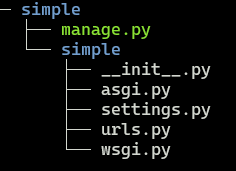
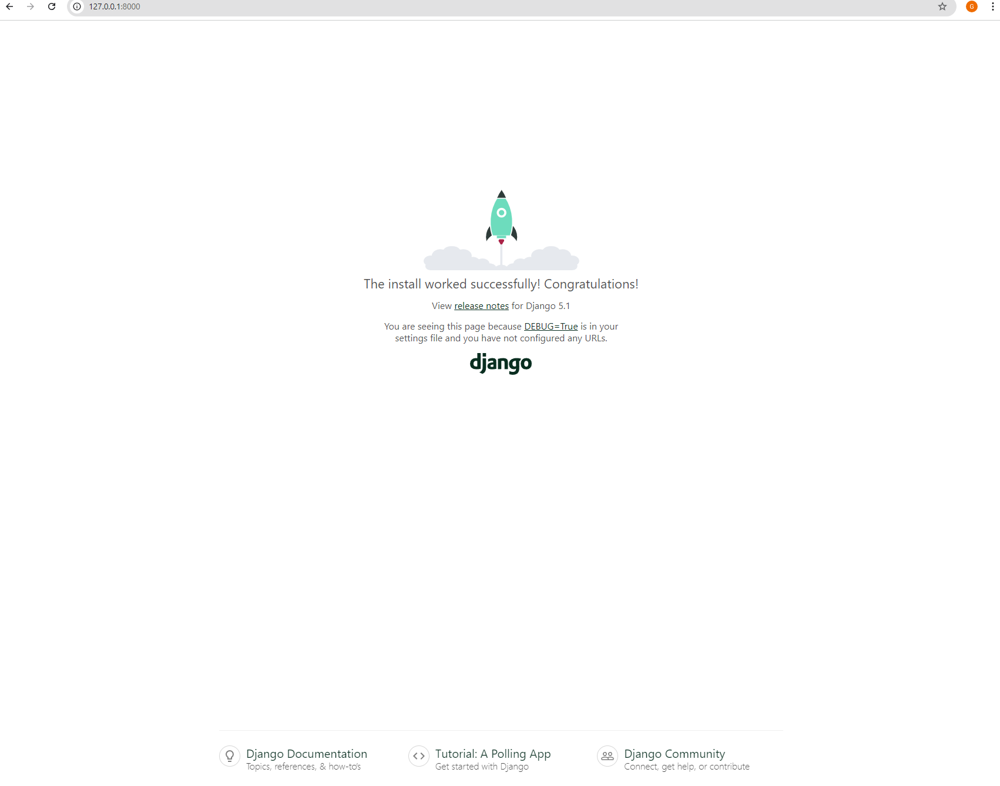
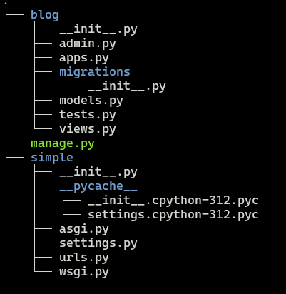
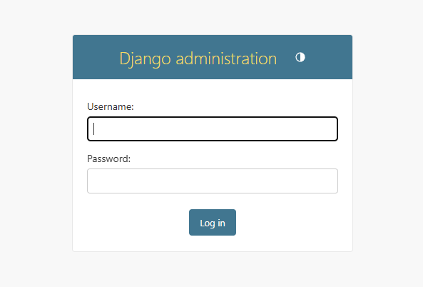
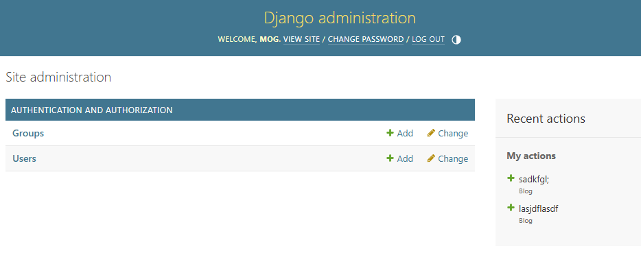

# Single User blog system

# Introduction

You're assumed to have basic knowledge and experience of linux and python.

This is the first project of the Django Beginner Series. It introduces Django web development and related concepts.

# Objectives

- setting up Django development environment
- Understanding General Project Structure
- Being able to apply General steps of Djnago web development

## Key Take-Aways

1. Installing Django
2. Creating project.
3. Creating app
4. Registering/unregistering your app to the proejct
5. Configuring project & application in `settings.py`
6. Understanding basic usage of command line `python manage.py` & `django-admin`
7. Understanding ORM, creating Models and using model access API
8. Understanding URLconf, function view, templates
9. error handling & get_object_or_404

# Installing Django in python Virtual environment

```shell
# installing python virtual environment
python -m venv /path/to/new/virtual/environment
# or
pip install virtualenv

# activate the virtural environment
source /path/to/new/virtual/environment/bin/activate

# add Django to requirements.txt
echo Django >> requirements.txt

# install Django using pip
pip install -r requirements.txt
```

## reference

[python virtural environment](https://docs.python.org/3/library/venv.html)

# Creating Project

There are two ways of creating a django proejct.

```shell

# method 1:
# creating a default project folder named the same as the project.
django-admin startproject <PROJECT-NAME>

# method 2:
# specifying a path for holding the project
django-admin startproject <PROJECT-NAME> /path/to/hold/the/project

```

By running the following command, Django will create a directory named `simple` and also will create a project named `simple` within the directory

```shell

django-admin startproject simple

```

The default structure of a proejct is shown below.

## Project structure

```shell

└── simple
    ├── manage.py
    └── simple
        ├── __init__.py
        ├── asgi.py
        ├── settings.py
        ├── urls.py
        └── wsgi.py

```

<!--  -->

### [Usage of Each File](https://docs.djangoproject.com/en/5.1/intro/tutorial01/)

- `manage.py`:
- `settings.py`. This file controls project wide configuration.
- `urls.py`. This the default file that controls the root URL configuration. It is usually used to map app URLs
- `wsgi.py`.

```shell
# start the django server and tests if it is creating correctly
python manage.py runserver 0.0.0.0:8000

```

you shold see the following output from your terminal


go to your web broswer, type in the URL: `http://localhost:8000`
you will see the following landing page:



# Creating app

```shell
# the following cmd will create an app <APP-NAME> within the project directory
python manage.py startapp <APP-NAME>

# in our example,
python manage.py startapp blog
```

The project structure became something looks like the following

```shell

└── simple
    ├── blog
    │   ├── __init__.py
    │   ├── admin.py
    │   ├── apps.py
    │   ├── migrations
    │   │   └── __init__.py
    │   ├── models.py
    │   ├── tests.py
    │   └── views.py
    ├── manage.py
    └── simple
        ├── __init__.py
        ├── asgi.py
        ├── settings.py
        ├── urls.py
        └── wsgi.py
```

<!--  -->

## Usage of Each File

- `admin.py`.
- `apps.py`.
- `models.py`
- `tests.py`
- `views.py`
- `migrations/`

## Registering/Unregistering Your App to the Project

To register your application to the project, locate `iNSTALLED_APP` in `settings.py` and add the name of your app to the list, and delete or comment it out if you want to unregister it.

```python
INSTALLED_APP += [
    'blog',
]

```

# Developing your app

# Creating models

Edit `models.py` and define a model class.

```python

from django.db import models
from django.contrib.auth.models import User
from django.utils import timezone

# class Blog defines a bunch of attributes, each attribute maps a field in the database table which is being created
class Blog(models.Model):
    title = models.CharField(max_length=100)
    author = models.ForeignKey(User, on_delete=models.CASCADE, related_name='blog_posts')
    published = models.DateTimeField(default=timezone.now)
    body = models.TextField()

    # similar to but different than meta class in python,
    class Meta:
        # define the dispaly order , + means ascednding, - means desending
        ordering = ('-published', )

    def __str__(self):
        return self.title
```

Key points

reference

## [Model](https://docs.djangoproject.com/en/5.1/topics/db/models/)

- Each model maps a single table in the database.
- Each model class subclass `Django.db.models.Model`
- Each attribute of the model represent a database field

### Fields

Specified by class attributes, **Fields** are the most important part of a model, and the only required part of a model. They define a list of database fields.

### Field types

- Each field should be an instance of appropriate [Field class](https://docs.djangoproject.com/en/5.1/ref/models/fields/#django.db.models.Field)

It Determine

- column type.
- the default HTML [widget](https://docs.djangoproject.com/en/5.1/ref/forms/widgets/) to use when rendering a form field.
- minimal validation requirements used in automatically generated form and Django's admin.

[model field reference](https://docs.djangoproject.com/en/5.1/ref/models/fields/#model-field-types)
[Creating custom model fields](https://docs.djangoproject.com/en/5.1/howto/custom-model-fields/)

### Field options(optionsl)

each field takes a certain set of field-specific arguments

[common set of options](https://docs.djangoproject.com/en/5.1/ref/models/fields/#common-model-field-options)

### Relationships

- One-to-One
- Many-to-One and ForeignKey (There can be many `blog` to one `user`.)
- many-to-many

### related_name and related_query_name

## Model Migration

Once a data model is defined, run the following command to set up the actual database. Before that, make suee the app is registered to the project

```shell
# make migrations, make sure your app is registered in the settings.py before running the following commands
python manage.py makemigrations
# do the migration
python manage.py migrate
```

the result displayed tells us the Django created a Blog model in `blog/migrations`


we can open the file `0001_initial.py` and take a look at the content, which is generated by Django after we executed the `makemigrations`
command

```python

import django.db.models.deletion
import django.utils.timezone
from django.conf import settings
from django.db import migrations, models


class Migration(migrations.Migration):

    initial = True

    dependencies = [
        migrations.swappable_dependency(settings.AUTH_USER_MODEL),
    ]

    operations = [
        migrations.CreateModel(
            name='Blog',
            fields=[
                ('id', models.BigAutoField(auto_created=True, primary_key=True, serialize=False, verbose_name='ID')),
                ('title', models.CharField(max_length=100)),
                ('published', models.DateTimeField(default=django.utils.timezone.now)),
                ('body', models.TextField()),
                ('author', models.ForeignKey(on_delete=django.db.models.deletion.CASCADE, to=settings.AUTH_USER_MODEL)),
            ],
            options={
                'ordering': ('-published',),
            },
        ),
    ]
```

we can also understand the essential of the file by running the following command

```shell

python manage.py sqlmigrate blog 0001
```

To unserstand the output, you will need some basic knowledge of SQL,

To actually create a database, you will need to run the following command

```shell
python manage.py migrate

```

In this project, we use the default settings for database, which is SQLite, in the project root

you can used `sqlite3` command to open the database file

## Making Queries

[making queries](https://docs.djangoproject.com/en/5.1/topics/db/queries/)
[API reference](https://docs.djangoproject.com/en/5.1/ref/models/)

- creating objects
- saving changes to objects
- retrieving objects and filters
- [QuerySet](https://docs.djangoproject.com/en/5.1/ref/models/querysets/#queryset-api)
- limiting queryset

## Django Admin Interface

```shell
# create super user to login to admin page and publish blogs
python manage.py createsuperuser
```

Then in your broswer, type `http://localhost:8000/admin`,

and login with the superuser credential you just created.





for now only pay attention to publishing blog post, but it seens that there is no entry for posting

Edit `admin.py`, and restart the Django server

```python
from django.contrib import admin
from blog import models

admin.site.register(models.Blog)
```

You see the entry `Blog`


Now try yourself and publish a few post

You can also create an Admin class to make the display more friendly

An admin class looks omething like the following

```python
from django.contrib import admin
from blog import models
# Register your models here.
class BlogAdmin(admin.ModelAdmin):
    list_display = (
        "title",
        "author",
    )

admin.site.register(models.Blog, BlogAdmin)
```

at thei point of time, you can write post, see post of your own, but no one else can see your post,

# Making blog post public accessible

## Using ORM accessing API in interactive mode

in the interactive mode, practice using ORM accessing API to access database

```shell
python manage.py shell
```

```python
from django.contrib.auth.models import User
from blog.models import Blog

user = User.objects.get(username='admin')
user.username
user.id
user.password

blogs = Blog.objects.all()
blogs

```

## Displaying Titles of Blogs

Apply the ORM acess API in your view to retrive and dispaly blog posts

edit `views.py`

```python
from django.shortcuts import render
from blog.models import Blog

# titles() is function view, there is anoother type of view, called class based view, which will be introduced in later proejcts

# the argument `request` is required, it is used to  accepts client request, and it is always in the first postion
# it can also accepts many other arguments
def titles(request):
    blogs = Blog.objects.all()
    return render(request, template_name='blog/titles.html', context={'blogs': blogs})
```

In this project we are using the default template settings..

Create template structure like the following

```shell
blog/templates/
├── base.html
└── blog
    └── titles.html
```

create `base.thml`

```html
<! DOCTYPE html>
<html lang="zh-cn">
  <head>
    <meta http-equiv="X-UA-Compatible" content="IE=Edge" />
    <meta charset="utf-8" />
    <meta name="viewport" content="width=device-width, initial-scale=1" />

    <!- servers as place holder --->
    <title></title>
    <link
      rel="stylesheet"
      href="https://cdn.bootcss.com/bootstrap/3.3.7/css/bootstrap.min.css"
    />
  </head>
  <body>
    <div class="container"> </div>
    <script src="https://cdn.bootcss.com/jquery/3.2.1/jquery.js"></script>
    <script src="https://cdn.bootcss.com/bootstrap/3.3.7/js/bootstrap.min.js"></script>
  </body>
</html>
```

create `titles.html`

```html

 <!--  inheritate template base.html, so that this template can extends tthe base.html-->

<br />

<!-- replace the content in the base template, -->
blog titles
<br />

<div class="row text-center vertical-middle-sm">
  <h1>My blogs<h1>
</div>
<div class="row">
  <div class="col-xs-12 col-md-8">
    <ul>
      
      <li>{{ blog.title }}</li>
      
    </ul>
  </div>
</div>

```

# URLconf

## Two Ways of UrL configuration

```python

# method 1, using name
    urlpatterns = [
        path('admin/', admin.site.urls),
        path('blog/', include(('blog.urls', 'blog'), namespace='blog')),
    ]

# method 2, using the app name attribute
# using this method, in the app url configuration file, add app_name='<APP_NAME>
    urlpatterns = [
        path('admin/', admin.site.urls),
        path('blog/', include('blog.urls', namespace='blog')),
    ]
```

## Root URL configuration

configure root url with`simple/urls.py`

```python
from django.contrib import admin
from django.urls import include, path

urlpatterns = [
    path("admin/", admin.site.urls),
  # should introduce or not the named
    path("blog/", include(("blog.urls", "blog"), namespace="blog")),
]
```

## App-spceific url configuration

configure app specific url with`blog/urls.py`

```python
from django.urls import path
from blog import views

urlpatterns = [
    path('', views.titles, name="titles"),
]
```

## Displying Content of Each Blog

best practice, using namespace, no matter how simple the application is.

edit `titles.html`

```html

<li><a href="{{ blog.id }}">{{ blog.title }}</a></li>

```

after testing in interactive mode, we can write code

```python
# blog/views.py

def post(request, post_id):
    post = Blog.objects.get(id=post_id)
    pub = post.published
    return render(request, "blog/content.html", {"post": post, "publish": pub})

```

`templates/blog/content.html`

```html
<!-- # templates/blog/content.html -->

<br />

blog posts
<br />


<div class="row text-center vertical-middle-sm">
  <h1>{{ post.title }}</h1>
</div>
<div class="row">
  <div class="col-xs-12 col-md-8">
    <p class="text-center">
      <span>{{ post.author.username }} </span
      ><span style="margin-left: 20px">{{ publish }}</span>
    </p>
    <div>{{ post.body }}</div>
  </div>
</div>

```

`blog/urls.py`

```python
# blog/urls.py

from django.urls import path

from blog import views

urlpatterns = [
    path("", views.titles, name="titles"),
    path("<int:post_id/>', views.post, name='post'),
]


# blog/views.py

def post(request, post_id):
    # post = Blog.objects.get(id=post_id)
    post = get_object_or_404(Blog, id=post_id)
    pub = post.published
    return render(request, "blog/content.html", {"post": post, "publish": pub})

```

# Quick Review

In general,
create project, startapp, regiser app, create model, makemigrations, migrate, config URL, template, view

# Summary

This Chapter demostrates a basic process of Django development, No matter how complex a project, it involves these basic steps, which is
creating project, starting application, regisering application, creating model, making migrations, migrating, creating template, configuring URL, creating view,

we also have a basic understanding of the Model-View-Controller(MTV) concepts of Django, Templates, Function View, URL configuration, ORM,

How Django response to a HTTP request

client sent HTTP request,
Django wraps the request as an HttpRequest object
pass the HttpRequest object to Request Middleware
the Requeset middleware return a HTTPResponse to View middleware
if exceptions occur, pass it to exception middleware,
else return a HttpResponse object, and invoke function view or class based view
pass result to response middleware,
Httpresponse

# Reference

[Object Relational Mapping (ORM)](https://en.wikipedia.org/wiki/Object-relational_mapping)
[What is an ORM and where can I learn more about it](https://stackoverflow.com/questions/1279613/what-is-an-orm-and-where-can-i-learn-more-about-it)
[URL dispatch](https://docs.djangoproject.com/en/5.1/topics/http/urls/)
[Writting your first Django app- official website](https://docs.djangoproject.com/en/5.1/intro/tutorial01/)
[Webistes Uisng Django](https://builtwithdjango.com/projects/)
[Django FAQ](https://docs.djangoproject.com/en/5.1/faq/)V
[ForeignKey](https://docs.djangoproject.com/en/5.1/ref/models/fields/#django.db.models.ForeignKey)
